# CS467 OWASP Juice Shop How-to Guide


## Injection Vulnerability - OWASP #3
#### Exploiting Injection via DOM XSS
###### By: Kuljot Biring

For this vulnerability it should be noted that Cross-site Scripting (XSS) is a vulnerability that allows an attacker to inject malicious scripts into web pages. They can be used to steal information. Hijack user sessions (cookies) and perform other nefarious actions.

Here we are going to inject a payload into the Document Object Model (DOM). Insecure client-side Javascript is allowing this XSS to take place.

Looking at the Juice Shop webpage, the area that stands out as a place to test any kind of injection or payload would be areas that allow user input. In our case this is the website's search bar.

Since we are just doing a proof of concept lets send a script that contains and alert. First, right click on the webpage and select inspect. This will open developers tools in a separate frame. In the search bar, we will enter: `<h1>Hacking is Cool</h1>`

Press enter. Notice how this shows up on the webpage search results? If we right click and inspect the text we put on the page, we can see it has been inserted into the code.

Now lets try inserting a bit of JavaScript. In the search bar enter the following and hit enter:

```
<iframe src="javascript:alert(`HERE IS AN XSS INJECTION - KULJOT BIRING`)">.
```


_Screen shot of payload in the search bar_


If we search for this string in the page inspector we entered, we can see our iframe has been injected into the code. Now imagine if this had been something much more malicious being injected into our code such as code to steal a user's cookies?


_code inserted into DOM_

#### Remediating the Injection Vulnerability

OK, now that we know we can perform injection attacks via the search bar, we look to how we can remedy this. Let's find the code that deals with the search bar. After some digging we see that in the folder:

```
frontend > src > app > search-result
```
there is a file called `search-result.component.ts`. In this file we can see the following snippet of code which seems to be overriding Angular's built-in safeguards which would prevent an XSS attack.


_image of insecure code_


The solution here is to remedy this code by not bypassing built-in security trusts in the first place.


_code fix_


#### Key Takeaways

XSS allows malicious code to be injected. Without sanitization and security checks, bad actors can perform a number of actions which can lead to various effects such as; running malicious scripts which can steal user information, cookies and run a wide variety of other nefarious code on your webpage. Here we are simply using a DOM XSS to trigger an alert as a proof of concept. However, as you can see, this vulnerability has a lot of potential for harm.

## Vulnerable and Outdated Components - OWASP #6
#### Exploiting Outdated Allowlist
###### By: Jason Gottlieb

For this vulnerability we will be looking at how outdated parts of a web application can be used as an attack vector. Often, websites will want to move users to another website to handle things such as donations or payments. Since developers want to ensure that users are only redirected to websites that are safe, they will ensure that only certain websites can be used as a redirect. The term for this collection of allowed URL's is an Allowlist. If an attacker tries to redirect a user through the site to a URL that they control, it won't work. 

This concept works well to protect users, but can unintentionally be used as an opportunity for scammers when the list is out of date. In this scenario, the Juice Shop has an outdated Allowlist that will let users be redirected to Cryptocurrency wallet sites. In the past, the Juice Shop used one of this wallets for a legitimate purpose, to collect payments from users. However, the Juice Shop has stopped using the wallet but left the URL's in the Allowlist. 

If an attacker was to discover that these URL's are in the Allowlist, they could generate their own wallet URL that is slightly different from the official Juice Shop one and present it to users. Since the URL would redirect through the Juice Shop site, it would be very hard for the average user to tell that this is a scam. Let's go over how an attacker might discover a vulnerable link.

First, right click on the webpage and select inspect. Navigate to the debugger tab and take a look at main.js. From there we can use CTRL-F to search for the string "redirect" until we come accross a URL that could be used as an attack vector.

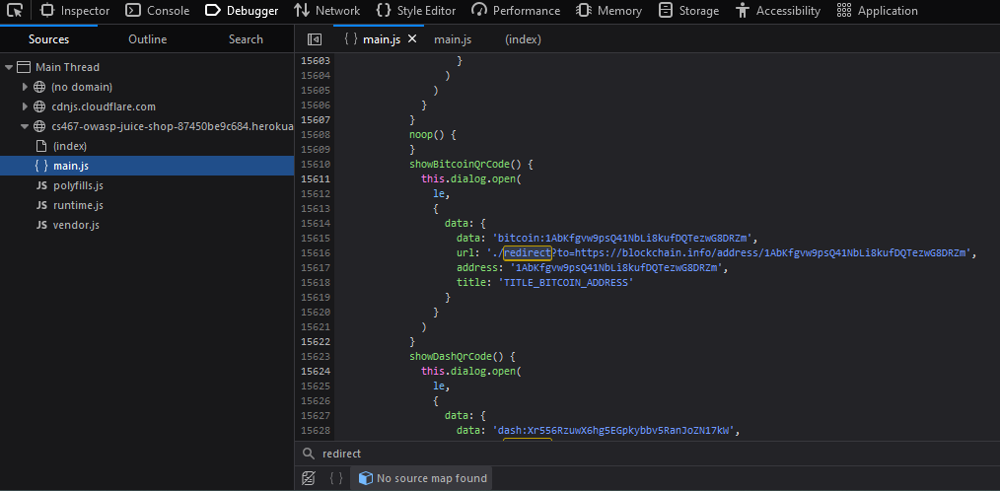

_image of potentially vulnerable URL_


Here we find the following URL:
```
/redirect?to=https://blockchain.info/address/1AbKfgvw9psQ41NbLi8kufDQTezwG8DRZm
```

If we are to paste that into our search bar, we will be redirected to a Cryptocurrency wallet. While this by itself isn't an issue, the Juice Shop no longer uses these wallets to collect payments so we are just leaving an attack vector open with no benefit.

#### Remediating the Outdated Component Vulnerability

The easiest way to fix this vulnerability is to remove those URL's from the Allowlist. Inside the lib folder there is a file called `insecurity.ts` that handles the Allowlist.

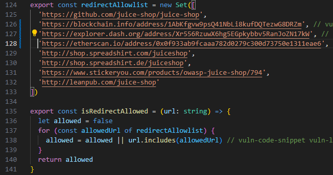

_image of insecure code_

The solution is to remove any URL's that we don't want to  be redirected. Just comment out the appropriate URL's.


_code fix_

#### Key Takeaways

Allowlists are a powerful tool in controlling where users can be redirected. However, if they fall out of date they can become a serious vulnerability. Developers should strive to make sure that the URL's that are within their Allowlist are secure and can't be used for phishing scams. Additionally, Allowlists should be kept up to date. Developers should add checking their Allowlist to a regular maintenance schedule and frequently audit which URL's are contained within it.

## Cryptographic Failures vulnerability - OWASP #2
#### Exploiting Sensitive Data
###### By: Pontipe Kopkaew

For this vulnerability, we will exploit a confidential document. The goal is to find a hidden file containing sensitive information about potential hostile takeovers by management. By exploring various links within the application, we should be able to locate this unprotected file and access its contents.

To begin, we do not need any tools to exploit the vulnerability; instead, we should thoroughly explore the Juice Shop website, looking for links that might lead to embedded documents.

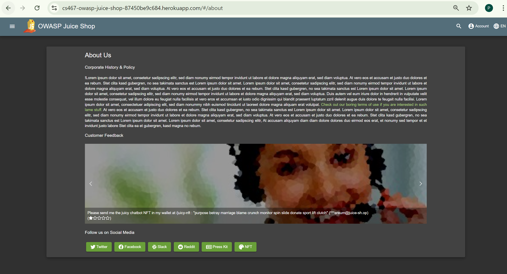

_screenshot of About Us Page_

There is a link on the "About Us" page that directs users to the terms of use, which leads to the URL: https://cs467-owasp-juice-shop-87450be9c684.herokuapp.com/ftp/legal.md. From this, we can deduce that the document is named legal.md and is located in the ftp directory, prompting us to investigate further.


_screenshot of the content of legal.md_

The next step is to navigate to the directory at https://cs467-owasp-juice-shop-87450be9c684.herokuapp.com/ftp to check its contents.

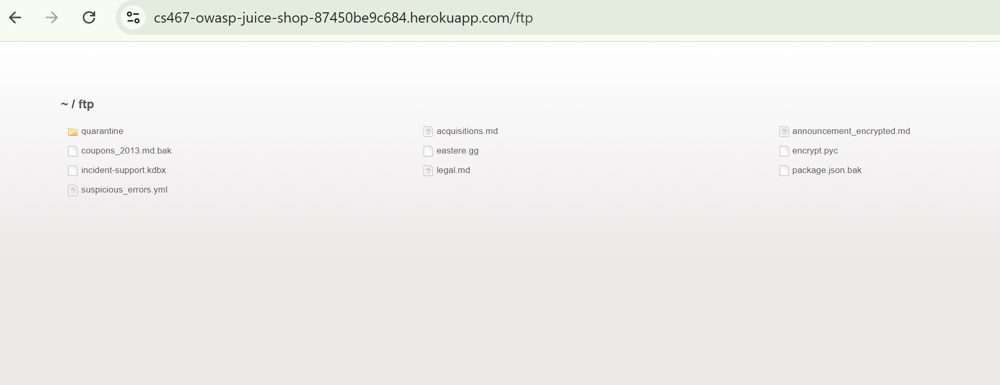

_screenshot of the content of the ftp directory_

Finally, if we examine the contents of the directory, we will discover that acquisitions.md is the file containing the sensitive data we are seeking.


_screenshot of the content of acquisitions.md_

#### Remediating Cryptographic Failures vulnerability

To address this issue, we should eliminate access to the directory listing of /ftp directory by commenting out the relevant code snippet in the server.ts file of the application. This code creates an endpoint that serves a directory listing of the ftp folder, which can be a potential security risk if not properly secured, as it could expose sensitive files to unauthorized users. By taking this action, we effectively resolve the data leak.

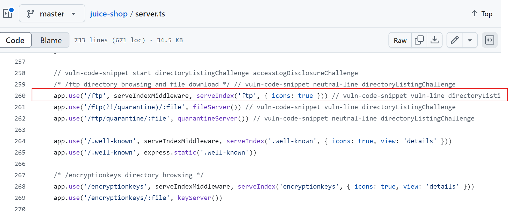

_screenshot of insecure code snippet from GitHub_


_screenshot of secure code snippet from code editor_

#### Key Takeaways

The key takeaway from this exploit is the importance for organizations to prioritize strong data protection measures to keep sensitive information safe. Protecting data is important not only for maintaining customer trust but also for complying with legal regulations and avoiding potential financial losses. Regularly reviewing and enhancing security practices is vital for reducing risks and ensuring that data is secure from potential threats.

## Identification and Authentication Failures vulnerability - OWASP #7
#### Password Strength
###### By: Pontipe Kopkaew

For this vulnerability, we will exploit password strength. The goal is to log in with the administrator's user credentials without previously changing them or applying SQL Injection.

We will use Burp Suite, a popular tool for intercepting and modifying HTTP requests. The steps to exploit the vulnerability are as follows:

To begin, The administrator's email address is already given in the product page, under the reviews section. It is admin@juice-sh.op. 

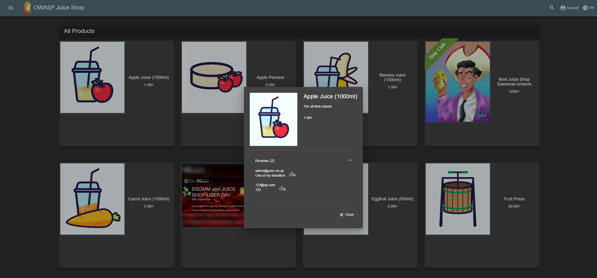

_screenshot of the products page displaying the admin email address_

Next, we have to guess the password. The challenge requires us to find the admin's password without changing it or using SQL injection. We can rely on the fact that many systems have weak or predictable passwords, especially for admin accounts. 

To do this, Let's capture the admin login request using Burp Suite's Interceptor feature.

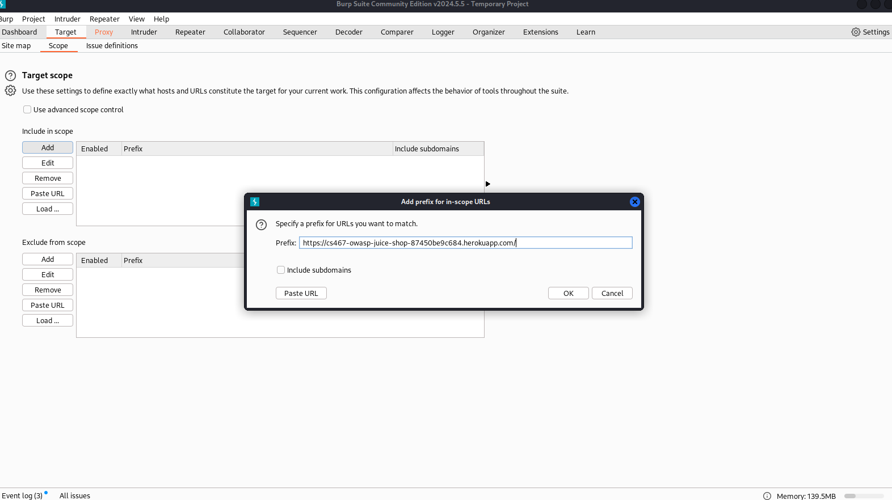

_screenshot of Burp Suite setup_

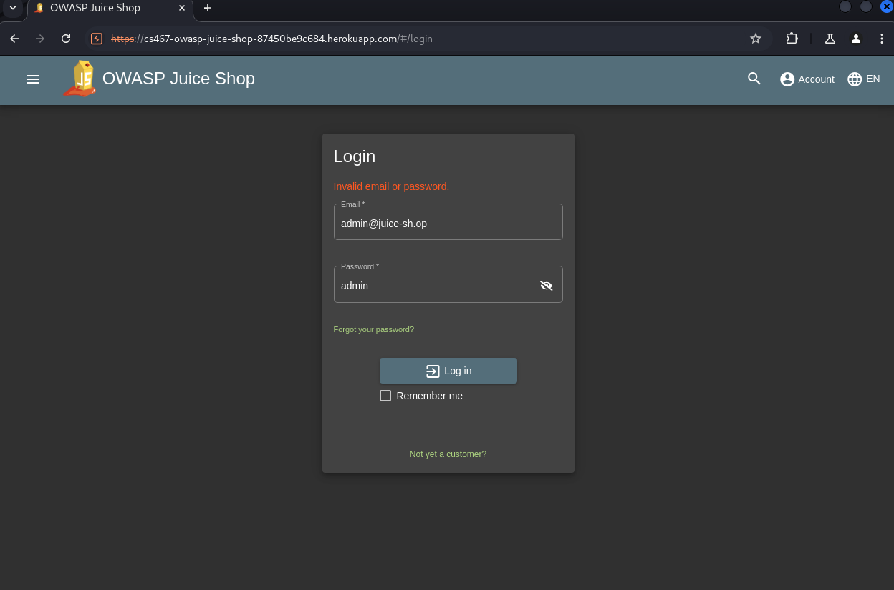

_screenshot of failed attempt to log in_

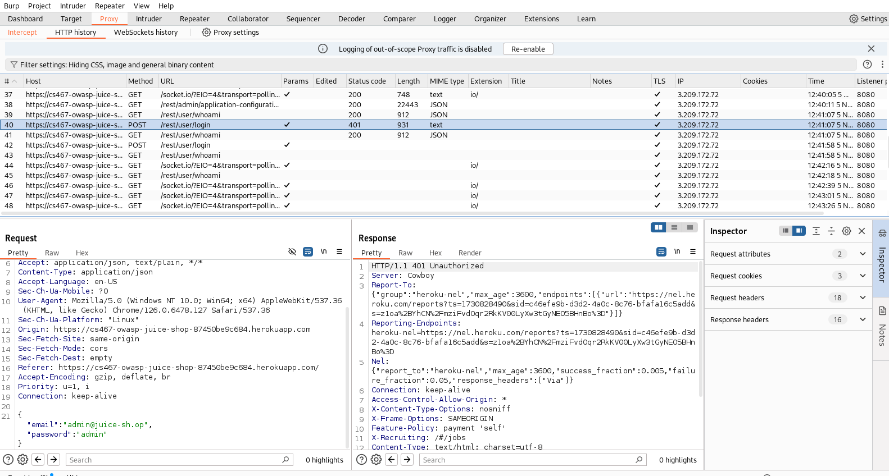

_screenshot of the Burp Suite Proxy result_

Pick a  list of common passwords (e.g., admin, password123, 123456, etc.), which are often used in weak password configurations. The Intruder feature in Burp Suite to automate the process of guessing the password. This tool allowed me to send a series of requests with different password combinations, automatically testing them against the login endpoint until the correct one was found.

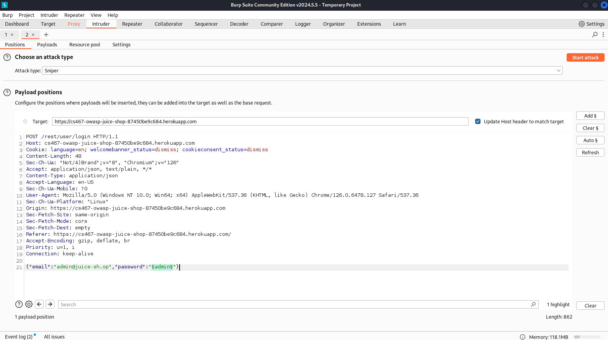

_screenshot of Burp Suite intruder result_

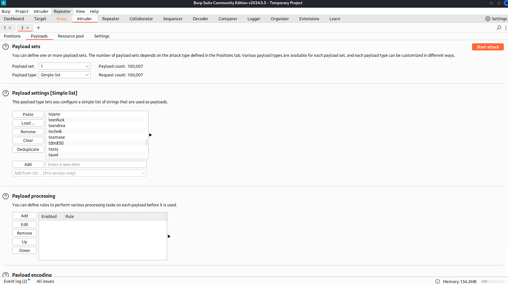

_screenshot of the intruder payload setup_

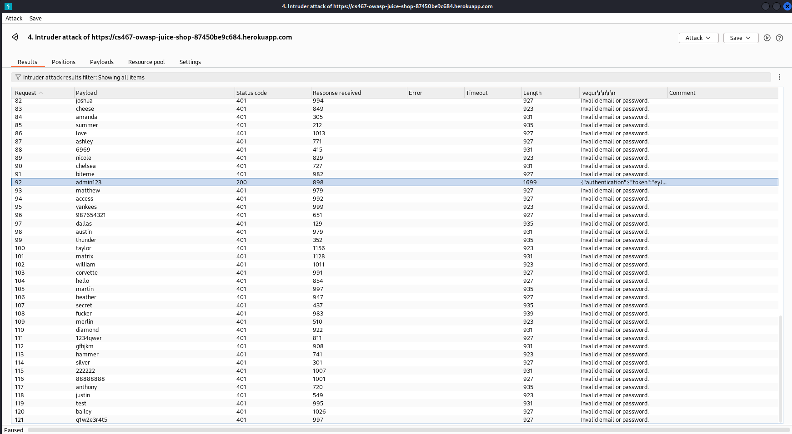

_screenshot of the the processing of the passwords list_

As shown in the screenshot above, the password "admin123" returns a status code 200, indicating a successful login. By testing this password, we are able to gain access with the correct credentials. This proved that the admin's password is weak and vulnerable to brute-force or simple guessing attacks.


_screenshot of the user's profile_

#### Remediating Identification and Authentication Failures vulnerability
To address the password strength vulnerability in the register form (\frontend\src\app\register) of the OWASP Juice Shop, I reinforced the validation logic to ensure that passwords meet specific strength criteria. These changes were made in the following files:

- Code 1: register.component.html
    I added validation feedback to the front-end form to notify users about password strength requirements. Specifically, I created a list of password criteria (such as minimum length, inclusion of digits, special characters, and prevention of common passwords), and displayed real-time feedback to users.

    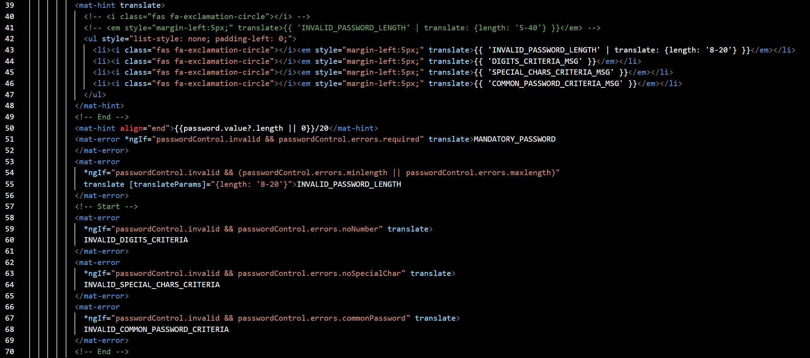

    _screenshot of the code snippet from register.component.html_

- Code 2: register.component.spec.ts
    I added unit tests to ensure that the password validation logic was working as expected. These tests cover various scenarios, such as password length, inclusion of numbers and special characters, and ensuring the password is not one of the most common passwords.

    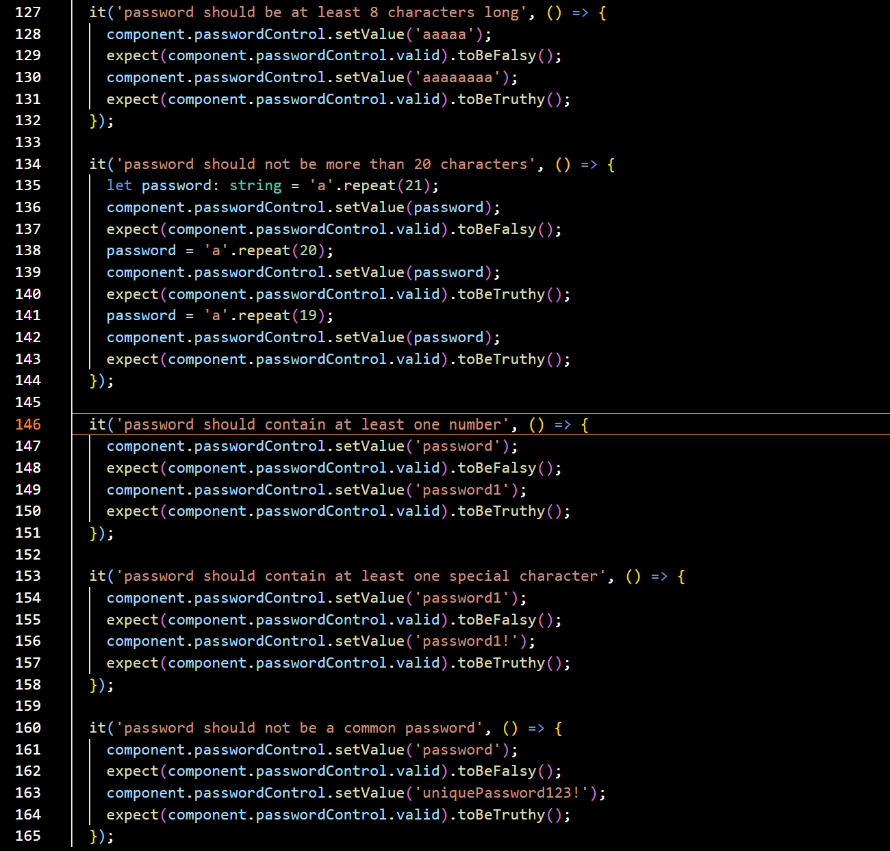

    _screenshot of the code snippet from register.component.spec.ts_

- Code 3: register.component.ts
    To implement the password validation logic on the back-end, I modified the password validator function to check for several criteria. These include checking the password length, ensuring the password contains at least one digit, at least one special character, and that the password is not a common password.

    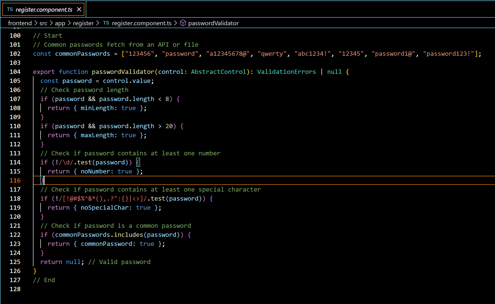

    _screenshot of the code snippet from register.component.ts_

#### Key Takeaways
The major takeaways from this exploit highlight the risks posed by weak passwords, which are common targets for attackers. Predictable passwords like "admin" or "password123" leave systems vulnerable to unauthorized access, especially when combined with automated attack tools like Burp Suite or Hydra, which can quickly perform brute-force attacks. To mitigate such vulnerabilities, it is important to implement strong authentication controls, including enforcing complex password policies, setting up account lockout mechanisms to thwart brute-force attempts, and utilizing multi-factor authentication (MFA) for added security, particularly for administrative accounts.
